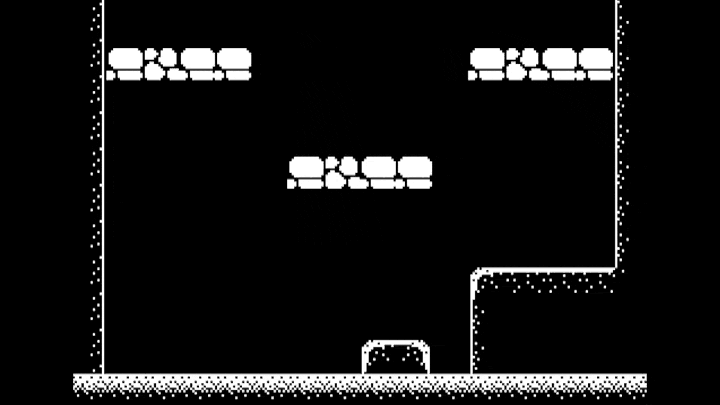

# Growbel

A 2D game built with Ebitengine, featuring a modular architecture.

## Architecture Overview

The project is structured into two main packages: `engine` and `game`.

- **`internal/engine`**: The core game engine, providing reusable components for scenes, physics, actors, and other systems.
- **`internal/game`**: The specific implementation of the game, including scenes, characters, and items.

This separation allows the engine to be developed independently from the game's content.

## Play Now

You can play the game directly in your browser here: <https://leandroatallah.itch.io/growbel>

## Folder Structure

```
.
├── .agents/             # AI Agent skill definitions
├── assets/              # Game assets (images, sounds, etc.)
│   ├── audio/           # Audio files
│   ├── fonts/           # Font files
│   ├── images/          # Image files
│   ├── particles/       # Particle effect configurations
│   ├── sequences/       # Scripted sequences (JSON)
│   └── tilemap/         # Tilemap related assets (TMJ, TSX, PNG)
├── main.go              # Application entry point
├── internal/
│   ├── engine/          # Core game engine components
│   │   ├── app/         # Main engine loop, context, and initialization
│   │   ├── assets/      # Asset loading and management (images, fonts)
│   │   ├── audio/       # Audio playback functionality
│   │   ├── contracts/   # Interfaces for engine components (animation, body, config, context, navigation, sequences, tilemaplayer, vfx)
│   │   ├── data/        # Data loading, management, and configuration schemas
│   │   │   └── config/  # Engine configuration
│   │   │   └── i18n/    # Internationalization (i18n) manager and translation loading
│   │   ├── entity/      # Foundational structures for in-game objects (actors, items)
│   │   │   ├── actors/  # Actor management and movement (e.g., characters, enemies)
│   │   │   └── items/   # Item management
│   │   ├── event/       # Event handling system
│   │   ├── input/       # User input handling
│   │   ├── mocks/       # Test mocks for engine components
│   │   ├── physics/     # Physics simulation (body, movement, skill, space)
│   │   ├── render/      # Rendering tasks (camera, particles, screenutil, sprites, tilemap, vfx)
│   │   │   └── camera/  # Camera control and rendering
│   │   ├── scene/       # Game scene management and transitions
│   │   ├── sequences/   # Game sequences and command processing (commands_*.go)
│   │   ├── ui/          # Building blocks for user interface elements (hud, menu, speech)
│   │   └── utils/       # Utility functions (fixed-point arithmetic, timing, triggers)
│   └── game/            # Game-specific implementation
│       ├── app/         # Game-specific setup and initialization (config, setup_audio, setup)
│       ├── entity/      # Concrete game entities
│       │   ├── actors/  # Player, NPCs, Enemies and state logic (enemies, events, methods, states)
│       │   ├── items/   # Game-specific items (coins, falling platforms)
│       │   └── obstacles/ # Game-specific obstacles (walls, hazards)
│       ├── physics/     # Game-specific physics behaviors and skills
│       ├── render/      # Game-specific rendering logic (camera, vfx)
│       ├── scenes/      # Game scenes (intro, menu, credits, story, summary)
│       └── ui/          # Game's specific user interface (hud, speech)
├── scripts/             # Development and automation scripts
├── go.mod               # Go module definition
├── Makefile             # Command automation
└── README.md
```

## Development

### Makefile Targets

The project includes a `Makefile` to automate common tasks:

- `make build-wasm`: Compiles the game to WebAssembly and creates a distributable zip.
- `make sync-agents`: Synchronizes AI agent definitions from `.agents/agents` to supported AI tool directories (`.claude`, `.qwen`, `.kiro`).
- `make setup`: Initializes the development environment by installing git hooks and creating skill symlinks.
- `make clean`: Removes generated build artifacts and temporary files.

### Scripts

Custom scripts are located in the `scripts/` directory:

- `build_wasm.sh`: Handles the multi-step process of building for the web.
- `sync-agents.sh`: Transforms agent definitions from `.agents/agents/` to tool-specific formats for Claude, Kiro, and Qwen.
- `setup-skill-symlinks.sh`: Creates symlinks from `.agents/skills/` to tool directories for instant skill propagation.
- `test_coverage.sh`: Runs the full test suite and generates an HTML coverage report in the `coverage/` directory.
- `hooks/pre-commit`: A git hook that automatically syncs agents before each commit.

### AI Agent Skills

This project uses specialized instructions for AI agents (like Claude, Gemini, or Qwen) stored in `.agents/skills/`. These skills provide agents with domain-specific knowledge about the engine's architecture, testing strategies, and coding standards.

Skills are automatically available to all AI tools via symlinks. To update a skill, edit the `SKILL.md` file in `.agents/skills/[skill-name]/` and changes propagate instantly.

### AI Agents

Specialized subagents for test coverage automation are defined in `.agents/agents/`. These agents coordinate to analyze coverage gaps, generate mocks, write tests, and verify improvements.

To update agents:
1. Edit files in `.agents/agents/`
2. Run `make sync-agents` to propagate changes to all AI tools

## Dependencies

- **Ebitengine**: A dead simple 2D game engine for Go.
- **EbitenUI**: A UI library for Ebitengine.
- **Kamera/v2**: A camera library for Ebitengine.
- **Go**: The programming language.

## Code Style Guidelines

### Avoid `_ = variable` Pattern

Do **not** use `_ = variable` to silence unused variable warnings in production code. This pattern clutters code and hides potential issues.

**Instead, use one of these approaches:**

1. **Use blank identifier in parameter list** (for unused params):

   ```go
   func (t *Transition) Draw(_ *ebiten.Image) {}
   ```

2. **Remove unused variables entirely** if not needed

3. **Actually use the variable** if it should be used

**Acceptable uses of `_`:**

- Ignoring return values: `_, err := someFunc()`
- Blank identifier in assignments: `val, _ = map[key]`
